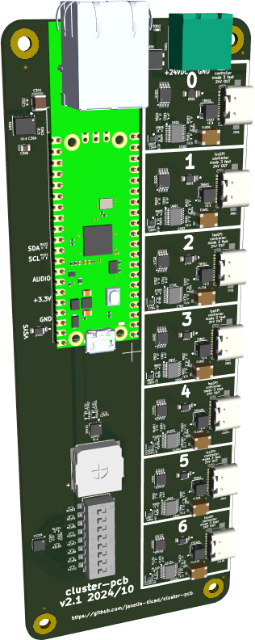
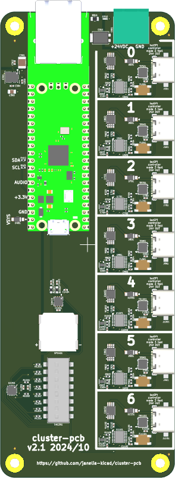
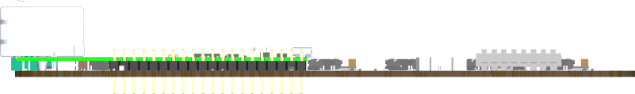
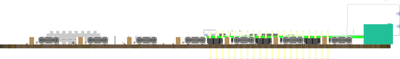
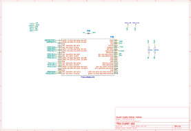
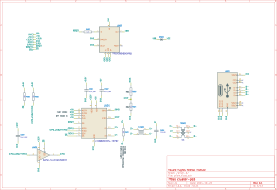
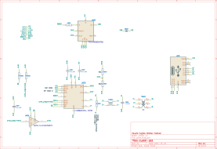
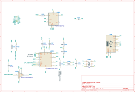
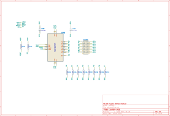
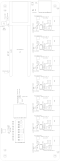

- [Repository Info](#orgbcb5dba)
- [Images](#orgb38789e)
- [Schematic](#org472700f)
- [PCB](#orgd3d77fc)
- [Bill of Materials](#orgf19c755)
- [Development](#org33de681)

    <!-- This file is generated automatically from metadata -->
    <!-- File edits may be overwritten! -->


<a id="orgbcb5dba"></a>

# Repository Info

-   Project Name: cluster-pcb
-   Synopsis: PCB for each cluster of prisms in the Voigts Lab honeycomb maze.
-   Documentation Version: 2.1.0
-   Pcb Version: 2.1
-   Enclosure Version: 1.0
-   Supplemental BOM Version: 2.1.0
-   Release Date: 2024-12-16
-   Creation Date: 2024-06-28
-   Kicad Version: 7.0.11
-   License: BSD-3-Clause
-   URL: <https://github.com/janelia-kicad/cluster-pcb>
-   Author: Peter Polidoro
-   Email: peter@polidoro.io
-   Copyright: 2024 Howard Hughes Medical Institute
-   References:
    -   <https://github.com/janelia-kicad/prism-pcb>
    -   [W5500-EVB-Pico](https://docs.wiznet.io/Product/iEthernet/W5500/w5500-evb-pico)




<a id="orgb38789e"></a>

# Images









<a id="org472700f"></a>

# Schematic

[./documentation/schematic/cluster-pcb.pdf](./documentation/schematic/cluster-pcb.pdf)















<a id="orgd3d77fc"></a>

# PCB





<a id="orgf19c755"></a>

# Bill of Materials


## Board

| Item | Synopsis                                  | Manufacturer Part Number | Manufacturer                         | Quantity | Reference(s)                                                                                                                    | Package            |
|---- |----------------------------------------- |------------------------ |------------------------------------ |-------- |------------------------------------------------------------------------------------------------------------------------------- |------------------ |
| 1    | 50V 3.3uF                                 | FS32X335K500EGG          | PSA(Prosperity Dielectrics)          | 1        | C301                                                                                                                            | 1210               |
| 2    | CAP CER 0.1UF 100V X5R                    | GRM155R62A104KE14D       | Murata Electronics                   | 24       | C302 C501 C502 C504 C601 C602 C604 C701 C702 C704 C801 C802 C804 C901 C902 C904 C1001 C1002 C1004 C1101 C1102 C1104 C1201 C1202 | 0402               |
| 3    | CAP CER 1UF 25V X5R                       | GRT155R61E105KE01D       | Murata Electronics                   | 2        | C303 C304                                                                                                                       | 0402               |
| 4    | CAP CER 47UF 10V X5R                      | CGA0805X5R476M100MT      | HRE                                  | 1        | C305                                                                                                                            | 0805               |
| 5    | CAP CER 27pF 50V 5%                       | 0402CG270J500NT          | FH (Guangdong Fenghua Advanced Tech) | 7        | C503 C603 C703 C803 C903 C1003 C1103                                                                                            | 0402               |
| 6    | CAP CER 1UF 35V X5R                       | CL05A105KL5NRNC          | Samsung Electro-Mechanics            | 1        | C1401                                                                                                                           | 0402               |
| 7    | CAP CER 0.22UF 25V X6S                    | GRT155C81E224KE01D       | Murata Electronics                   | 3        | C1402 C1403 C1404                                                                                                               | 0402               |
| 8    | 50V 15A PowerDI-5 Super Barrier Rectifier | SBRT15U50SP5-13          | Diodes Incorporated                  | 1        | D301                                                                                                                            | PowerDI-5          |
| 9    | LED RED CLEAR CHIP SMD                    | APHHS1005SURCK           | Kingbright                           | 1        | D302                                                                                                                            | 0402               |
| 10   | DIODE SCHOTTKY 20V 1A                     | MBR120VLSFT1G            | onsemi                               | 8        | D401 D501 D601 D701 D801 D901 D1001 D1101                                                                                       | SOD-123FL          |
| 11   | CMC 22UH 200MA 2LN 1.2KOHM SMD            | ACT45B-220-2P-TL003      | TDK                                  | 7        | FL501 FL601 FL701 FL801 FL901 FL1001 FL1101                                                                                     | 1812               |
| 12   | USB Type-C 2.0 16P 5A                     | GT-USB-7047C             | G-Switch                             | 7        | J501 J601 J701 J801 J901 J1001 J1101                                                                                            | SMD                |
| 13   | RA73F 2A 2K32 0.1% 5K RL                  | RA73F2A2K32BTD           | TE Connectivity Passive Product      | 1        | R301                                                                                                                            | 0805               |
| 14   | RES SMD 1.8K OHM 5% 100mW                 | ERJ2GEJ182X              | PANASONIC                            | 16       | R401 R402 R505 R506 R605 R606 R705 R706 R805 R806 R905 R906 R1005 R1006 R1105 R1106                                             | 0402               |
| 15   | RES SMD 100 OHM 1% 62.5mW                 | 0402WGF1000TCE           | UNI-ROYAL(Uniroyal Elec)             | 7        | R501 R601 R701 R801 R901 R1001 R1101                                                                                            | 0402               |
| 16   | RES SMD 4.7K OHM 1% 6.25mW                | 0402WGF4701TCE           | UNI-ROYAL(Uniroyal Elec)             | 7        | R502 R602 R702 R802 R902 R1002 R1102                                                                                            | 0402               |
| 17   | RES SMD 1.4K OHM 1% 62.5mW                | RC0402FR-071K4L          | YAGEO                                | 7        | R503 R603 R703 R803 R903 R1003 R1103                                                                                            | 0402               |
| 18   | RES SMD 604 OHM 1% 100mW                  | ERJ2RKF6040X             | PANASONIC                            | 7        | R504 R604 R704 R804 R904 R1004 R1104                                                                                            | 0402               |
| 19   | RES SMD 10K OHM 5% 1/10W                  | ERJ2GEJ103X              | PANASONIC                            | 10       | R1201 R1202 R1203 R1204 R1205 R1206 R1207 R1208 R1209 R1210                                                                     | 0402               |
| 20   | RES SMD 40k OHM 1% 100mW                  | SCR0603F40K              | VO                                   | 2        | R1401 R1402                                                                                                                     | 0603               |
| 21   | SPEAKER 8OHM 700MW                        | KLJ-01304T-08R07W        | KELIKING                             | 1        | SP1401                                                                                                                          |                    |
| 22   | SWITCH SLIDE DIP SPST 0.025A 24V          | SDA08H1SBDR              | C&K                                  | 1        | SW1201                                                                                                                          | SMD                |
| 23   | TERM BLOCK HDR 2POS 90DEG 5.08MM          | 1757242                  | Phoenix Contact                      | 1        | T301                                                                                                                            | Push-Pull P=5.08mm |
| 24   | Pulse Transformer 120uH 1CT:1CT           | FB020G00                 | Dongguan Mentech Optical & Magnetic  | 7        | TR501 TR601 TR701 TR801 TR901 TR1001 TR1101                                                                                     | SMD-6P 3.5x3.2mm   |
| 25   | DC-DC 5V 600mA Output 3-65V Input         | TPSM365R6V5RDNR          | Texas Instruments                    | 1        | U301                                                                                                                            | QFN-11(3.5x4.5)    |
| 26   | SPI Isolator                              | LTC6820HMS#3ZZTRPBF      | Analog Devices                       | 7        | U501 U601 U701 U801 U901 U1001 U1101                                                                                            | MSOP-16            |
| 27   | IC BUFF NON-INVERT 1.65-5.5V              | SN74LVC1G125DRYR         | Texas Instruments                    | 7        | U503 U603 U703 U803 U903 U1003 U1103                                                                                            | USON-6(1x1.5)      |
| 28   | IC XPNDR 400KHZ I2C SMBUS                 | TCA6408ARGTR             | Texas Instruments                    | 1        | U1201                                                                                                                           | QFN-16-EP(3x3)     |
| 29   | IC AMP CLASS AB MONO 1.7W                 | TPA6204A1DRBR            | Texas Instruments                    | 1        | U1401                                                                                                                           | QFN-8-EP(3x3)      |
|      | IC PWR DRIVER N-CHAN 1:1                  |                          | Texas Instruments                    | 7        | U502 U602 U702 U802 U902 U1002 U1102                                                                                            | EMSOP-8-EP         |


## Supplemental

| Item | Synopsis                        | Manufacturer Part Number | Manufacturer    | Quantity | Cost  | Total |
|---- |------------------------------- |------------------------ |--------------- |-------- |----- |----- |
| 1    | TERM BLOCK PLUG 2POS STR 5.08MM | 1758364                  | Phoenix Contact | 1        | 1.63  | 1.63  |
| 2    | CONN FERRULE DIN 16AWG BLACK    | 3200043                  | Phoenix Contact | 4        | 0.14  | 0.56  |
| 3    | POWER CABLE BULK SJT 16/3       | H-137                    | GlobTek, Inc.   | 1        | 2.40  | 2.40  |
| 4    | W5100S-EVB-PICO RP2040 W5100S   | W5100S-EVB-PICO          | WIZnet          | 1        | 9.95  | 9.95  |
| 5    | Supplemental BOM Version: 2.1.0 |                          |                 |          | Total | 14.54 |


<a id="org33de681"></a>

# Development


## Install Guix

[Install Guix](https://guix.gnu.org/manual/en/html_node/Binary-Installation.html)


## Generate Output from KiCad


### Remove previous versions

```sh
rm -rf ./documentation/3dmodels/* && rm -rf ./documentation/bom/* && rm -rf ./documentation/fabrication/* && rm -rf ./documentation/pcb/* && rm -rf ./documentation/schematic/*pcb
```


### Images

1.  3D Viewer

    Output directory: ../documentation/pcb
    
    -   pcb.png
    -   top.png
    -   bottom.png
    -   front.png
    -   back.png
    -   left.png
    -   right.png

2.  Trim

        make trimmed-images

3.  Schematic PDF

    File -> Plot
    
    Output directory: ../documentation/schematic
    
    Plot All Pages
    
    -   Output format PDF
    -   Page Size = Schematic size
    -   Plot drawing sheet
    -   Output mode = Color
    -   Color theme = KiCad Default
    -   Default line width = 0.006 in

4.  Schematic SVG

    File -> Plot
    
    Output directory: ../documentation/schematic
    
    Plot All Pages
    
    -   Output format SVG
    -   Page Size = Schematic size
    -   Plot drawing sheet
    -   Output mode = Color
    -   Color theme = Solarized Light
    -   Default line width = 0.012 in

5.  PCB SVG

    Add Edge.Cuts, holes, and dimensions to User.Drawings
    
    File -> Plot
    
    Output directory: ../documentation/pcb
    
    -   Plot format SVG
    -   Include Layers
        -   User.Drawings
        -   F.Silkscreen
        -   B.Silkscreen
        -   F.Fab
        -   B.Fab
    -   Plot on All Layers
        -   Edge.Cuts
    -   Plot footprint values
    -   Plot reference designators
    -   SVG Options
        -   Precision = 4
        -   Output mode = color
    
        make cropped-svg


### Fabrication Files

1.  Gerbers

    File -> Fabrication Outputs -> Gerbers (.gbr)
    
    Output directory: ../documentation/fabrication/gerbers
    
    Include Layers:
    
    -   F.Cu
    -   F.Paste
    -   F.Silks
    -   F.Mask
    -   F.Fab
    -   B.Cu
    -   B.Paste
    -   B.Silks
    -   B.Mask
    -   B.Fab
    -   Edge.Cuts - (contain the board outline/cutouts.)
    -   In1.Cu, In2.Cu … - (needed for 4/6 layer designs.)
    
    Options:
    
    -   Select Plot reference designators, otherwise designators will not appear on silkscreen layers.
    -   Select Check zone fills before plotting
    -   Select Use Protel filename extensions, this is recommended as JLCPCB prefers Protel filename extensions.
    -   Select Subtract soldermask from silkscreen, this ensures no silkscreen on pads.
    -   Coordinate format 4.6 unit mm

2.  Drill and Map Files

    Output directory: ../documentation/fabrication/gerbers
    
    Options:
    
    -   Excellon drill file format
    -   Check Use alternate drill mode for "Oval Holes Drill Mode".
    -   Check Absolute for "Drill Origin".
    -   Check Millimeters for "Drill Units".
    -   Check Decimal format for "Zeros Format".
    -   Gerber X2 map file format
    
    Zip gerber files
    
        zip ./documentation/fabrication/gerbers.zip ./documentation/fabrication/gerbers/*

3.  BOM

    Generate BOM from schematic editor using blank command line to create bom xml file.

4.  POS

    File -> Fabrication Outputs -> Component Placement (.pos)
    
    Output directory: ../documentation/fabrication/
    
    Settings:
    
    -   Format = CSV
    -   Units = Millimeters
    -   Files = Single file for board
    -   Do not use drill/place file origin
    
    Modify pos files:
    
    -   Ref -> Designator
    -   PosX -> Mid X
    -   PosY -> Mid Y
    -   Rot -> Rotation
    -   Side -> Layer

5.  Step

    File -> Export -> Step
    
    Output directory: ../documentation/3dmodels/pcb.step
    
    -   Drill/place file origin
    -   Overwrite old file
    -   Standard Board outline chaining tolerance


## Edit metadata.org

    make metadata-edits


## Tangle metadata.org

    make metadata


## Edit project

    make kicad-edits
    exit
